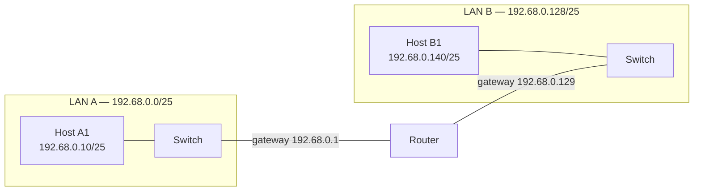

*This project has been created as part of the 42 curriculum by lseabra-.*

# NetPractice

## Description

NetPractice is a network-configuration training project. The goal is to build practical, hands-on understanding of how IP networks are addressed and interconnected, without writing any code. The project provides an interactive interface with a series of increasingly difficult levels; each level presents a small network topology (hosts, routers, switches) with some configuration values missing (IP addresses, subnet masks, gateways, etc.). The task is to fill in the missing values so that every device on the topology can correctly communicate with every other device, respecting real-world addressing and routing rules.

The exercise is entirely conceptual — success is measured by correctly reasoning about subnetting, routing, and addressing, not by producing working code.

## Instructions

### Requirements

- A modern web browser (no additional dependencies to compile or install).

### Running the training interface

From the repository root, extract data from the net_practice.1.9.tar with:

```bash
tar -xzvf net_practice.1.9.tar
```
*foot note*: -x (extract); -z (decompress gzip); -v (verbose); -f (specify filename).

Launch the interface with:

```bash
./net_practice/run.sh
```

This starts a local server and opens the NetPractice interface in your default browser, where the levels can be selected and solved interactively.

The intranet login is optional and just important to save the configuration file to be reviewed in evaluations and during the evaluation itself.

### Exporting a configuration

Once a level was solved (all devices can reach each other), the **Get my config** button in the interface was used to download the level's configuration file. All **10 exported configuration files** at the root of this repository are a result of this process.

## Resources

### Networking concepts studied

1. **MAC Addresses** (Layer 2)
- Unique fixed device address used to communicate with devices inside a Local Area Network (LAN).
2. **IP Addresses** (Layer 3)
- Internet Protocol: address that identifies a device inside a network and used to communicate in a Wide Area Network (WAN).
- Two types: IPV4 (32 bits in binary) and IPV6 (128 bits in hexadecimal).
- Net Masks: divide the IP in network and host bits, making explicit the network address and size.
	- Example 1: 255.255.255.0 or /24 implies that 3 octets (24 bits) are for the network and 1 octet to specify the host address.
	- Example 2: 255.255.255.192 or /26 implies that 26 bits are for the network and 6 bits to specify the host address.
- The Net Mask implies the size of the network, making explicit how many devices it can handle.
3. **Subnetting**
- Manipulating the mask, it's possible to subdivide a network. A network with the address/mask 192.68.0.0/24 can be divided in two with mask /25 and addresses 192.68.0.0 and 192.68.0.128.
- Broadcast address is the last address of the network, used to send packets to all devices inside it. In the case of 192.68.0.0/24, it would be 192.68.0.255
- Usable host addresses are the range - 2, excluding the first (network address) and last (broadcast) addresses.
4. **Network Devices**
- Hosts (end nodes)
- Switches: connects devices inside the same network using MAC address (layer 2).
- Routers: connects devices through different networks using the IP and Mask (layer 3).
5. **Communication Between Networks**
- The router is responsible for being the default gateway inside a LAN. It receives the packets and decides the best path for data packets to travel.
- To send a packet to a different subnet, the device sends the packet to the router (default gateway), which forwards it if a matching route is configured on the routing table. Otherwise, it's sent to the default gateway.
6. **Routing Tables**
- Stored on the router, defines the route telling how to reach a specific network in the subsequent format:
	- (Destination network)/(subnet mask) -> (gateway)
- If there isn't a route configured to a network, the packet is sent to the default gateway.
7. **The OSI Model**
- Conceptual framework with seven-layer architecture to describe how data is transmitted.
- The important layers for this project are:
	- Physical Layer (L1): hardware level bits transmission.
	- Data Link Layer (L2) bridge between physical and logical, ensuring the reliability of the data.
	- Network Layer (L3): logical addressing between networks and path finding.

### Example topology

A simplified topology tying the concepts above together — two LANs connected through a router, each host reaching the other subnet via its default gateway:



- Host A1 and Host B1 are in different subnets (`/25` split of `192.68.0.0/24`), so they can't reach each other directly through their switches — traffic must go through the router.
- Each host's default gateway is the router's interface on its own subnet.
- The router holds a routing table entry for each subnet so it knows which interface to forward packets out of.

### References

- [GeeksforGeeks — Physical Components of Computer Network](https://www.geeksforgeeks.org/computer-networks/physical-components-of-computer-network/)
- [GeeksforGeeks — Layers of OSI Model](https://www.geeksforgeeks.org/computer-networks/open-systems-interconnection-model-osi/)
- [GeeksforGeeks — Introduction To Subnetting](https://www.geeksforgeeks.org/computer-networks/introduction-to-subnetting/)
- [Network Chuck (Youtube Channel) — You Suck at Subneting](https://youtube.com/playlist?list=PLIhvC56v63IKrRHh3gvZZBAGvsvOhwrRF&si=UgtcGxO-b9kMqBv5)
- [IBM — TCP/IP addressing](https://www.ibm.com/docs/en/aix/7.2.0?topic=protocol-tcpip-addressing)
- [RFC 950 — Internet Standard Subnetting Procedure](https://www.rfc-editor.org/rfc/rfc950)
- [Descontruindo a Web — William Molinari](https://desconstruindoaweb.com.br/)

### AI usage

AI (ChatGPT / Claude / Gemini) was used during this project as a support tool, specifically for:

- Clarifying important concepts such as subnetting and OSI Model.
- Proofreading and improving the wording of this README.
- No AI was used to generate level solutions directly; all configurations were worked out and validated manually in the NetPractice interface.